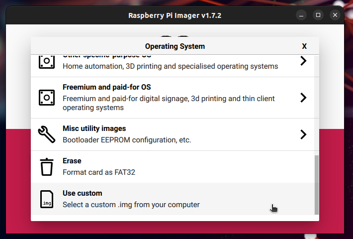

# build your own image for Raspberry Pi:
*(Tested on Pi4)*

## Prerequisite
```
#Download ubuntu arm release (optional)
cd ~/Download
wget https://cdimage.ubuntu.com/releases/22.04.5/release/ubuntu-22.04.5-preinstalled-desktop-arm64+raspi.img.xz
```
and modify `Conceal-Pi-OS.json` with:  
`"iso_url": "file:///home/<your-username>/Download/ubuntu-22.04.5-preinstalled-desktop-arm64+raspi.img.xz"`

## Dependencies
```
sudo apt update
sudo apt install git wget zip unzip build-essential kpartx qemu binfmt-support qemu-user-static e2fsprogs dosfstools
```

## install Packer version 1.6.6
```
export PACKER_RELEASE="1.6.6"
cd /tmp/
wget https://releases.hashicorp.com/packer/${PACKER_RELEASE}/packer_${PACKER_RELEASE}_linux_amd64.zip
unzip packer_${PACKER_RELEASE}_linux_amd64.zip
sudo mv packer /usr/local/bin
packer --version
```

## install arm Packer builder plugin:
```
export PACKER_ARM_BUILDER_VERSION="0.1.6"
cd /tmp/
wget https://github.com/solo-io/packer-builder-arm-image/releases/download/v${PACKER_ARM_BUILDER_VERSION}/packer-builder-arm-image
sudo mkdir -p ~/.packer.d/plugins
sudo chmod +x packer-builder-arm-image
sudo mv packer-builder-arm-image ~/.packer.d/plugins
```

## Pre Build
the `Conceal-Pi-OS.json` file can handle 2 versions : `22.04.5` or `24.01.1`.Input the one you want in the variable version field.

## Build
```
git clone https://github.com/Acktarius/Conceal-OS.git
cd Conceal-OS
sudo packer build Conceal-Pi-OS.json
```
output will be conceal-raspberry-pi-os-<version>.img
### Compress
```
xz -z -v -k -T 2 conceal-raspberry-pi-os-<version>.img
```

### Generate SHA256
```
sha256sum conceal-raspberry-pi-os-<version>.img.xz > conceal-raspberry-pi-os-<version>.img.xz.sha256
```


### Verify integrity
```
sha256sum -c conceal-raspberry-pi-os-<version>.img.xz.sha256
```


### Unzip
```
unxz conceal-raspberry-pi-os-<version>.img.img.xz
```

## Create bootable SSD
in raspberry pi imager, select **Use Custom**


## Setup
* plug SSD
* plug Raspberry Pi, after few flickering blue screen, Ubuntu should launch.
* setup keyboard, language preference and create user.
* Go through Ubuntu welcome Screens
:Warning: Ubuntu will want to update and upgrade, it's recommend to consider your operation and system limitation before doing so.  
* Consider changing your screen display orientation, follow guidance from your screen provider.

### Considering to Donate ?
* Donation to Conceal Network CCX address:
```
ccx7V4LeUXy2eZ9waDXgsLS7Uc11e2CpNSCWVdxEqSRFAm6P6NQhSb7XMG1D6VAZKmJeaJP37WYQg84zbNrPduTX2whZ5pacfj
```
* Donation to Acktarius CCX address:
```
ccx7Zbm7PjafXKvb3naqpGXzhLtAXesKiR5UXUbfwD9MCf77XdvXf1TX64KdDjcTDb3E7dS6MGE2GKT3w4DuCb8H9dwvWWGuof
```