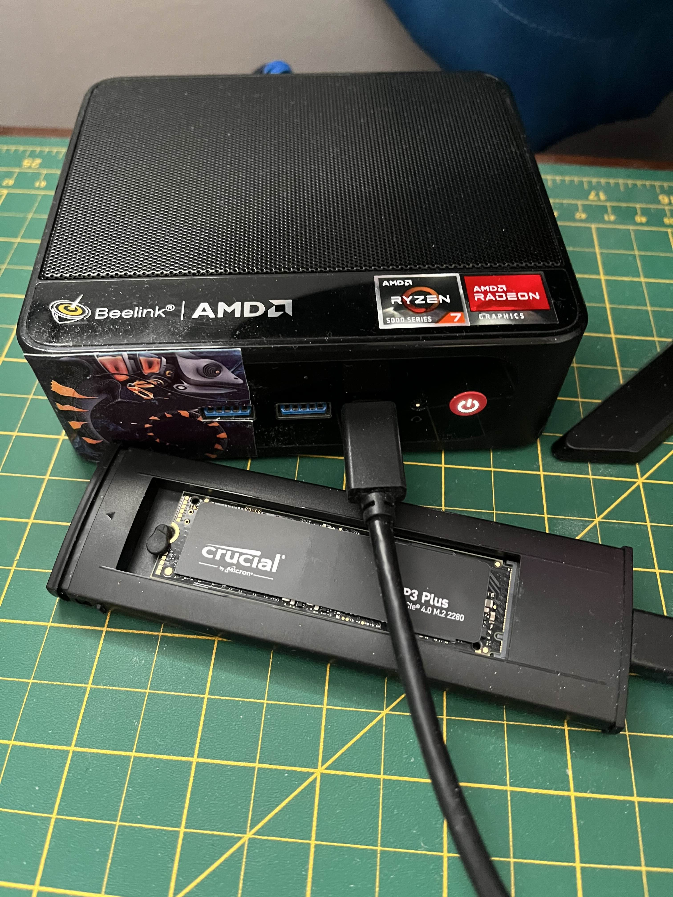
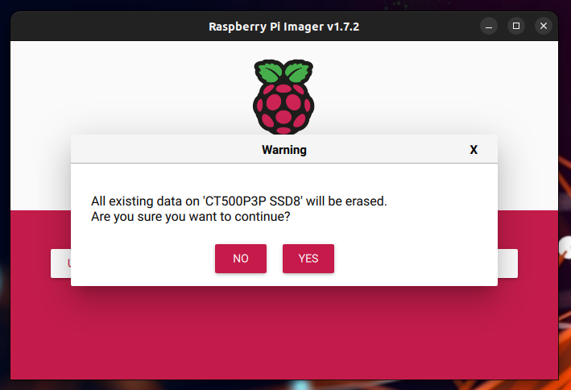
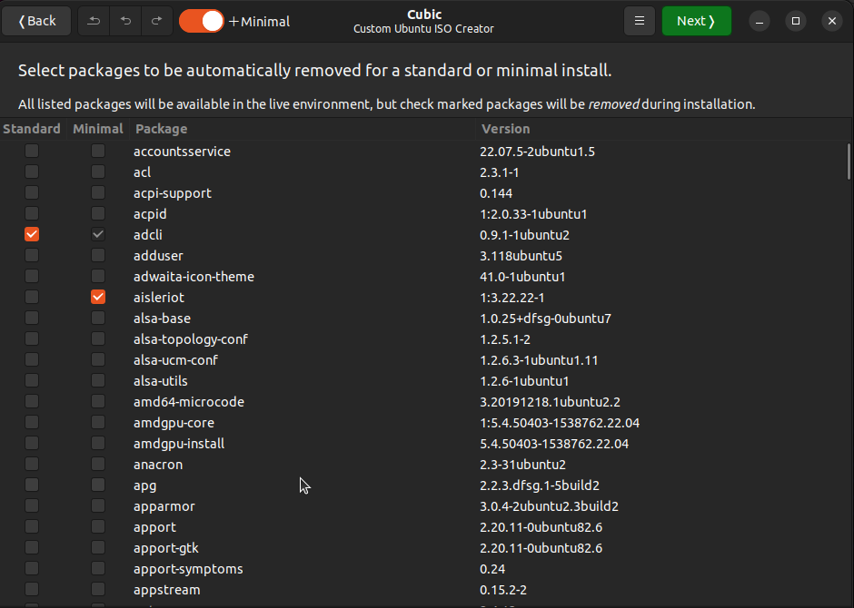

# RECIPE
here is a detailed step by step procedure to create your Conceal like OS on a Raspberry Pi.

## Prerequisite
1. You will need the Raspberry Pi imager, you can download from here:
    - [https://www.raspberrypi.com/software/](https://www.raspberrypi.com/software/)
   - you will also find some guidance from Ubuntu website: [https://ubuntu.com/tutorials/how-to-install-ubuntu-desktop-on-raspberry-pi-4#1-overview](https://ubuntu.com/tutorials/how-to-install-ubuntu-desktop-on-raspberry-pi-4#1-overview)

## First step with Raspberry Pi Imager:
 - Have the external SSD you are planing to use plug to your computer:

 - Launch Raspberry Pi imager and click on choose OS
   
  - Select other general-purpose OS
  
  - Select Ubuntu
   
  - Choose the Ubuntu Desktop version Compatible with your Raspberry Pi

  - Choose Storage, be carefull to select wisely

  - Advanced Option: pressing **Ctrl** + **Shift** + **X**  
  and set the parameters hostname, enable SSH and wifi config.


  - Write
  
  - Confirm

    

### Pre-set 
it can happen you get an error because of issue writting fat32 part, this means our latter pre-set won't be taken into account, two options from here:
 
    a. Use an other version of Raspberry Pi imager or on an other OS, or
 
    b. Drop the preset idea, and you'll setup at first boot.
  - get your ip address 
  - get your ip address (192.168.1.118 in this example)
  


## First Boot
 * Plug your external drive
 * Plug a mouse and keyboard
 * Plug a screen
 * Power up (plugging the adaptator)
here is what you should see:  

 * Go through the initial setup if that didnot work initially, language, keyboard  
 (hit enter to validate)

 * Time Zone

 * Credentials

 * Screen Orientation, you may have display orientation issue,
 click on the top right corner, Settings -> Screen Display -> Orientation  
 and choose what suits you.  

 * go through the final welcome step  
Also, decline the update at the moment and consider doing those later.  

 * open a terminal **Ctrl** + **Alt** + **T**, and get your local ip address indicated in the eth0 section by inet  
```
ip a
```

 (192.168.1.118 in this example)  

 * install openssh
```
sudo apt install -y openssh-server
```


*you could continue the setup on the pi, but in our case we will continue via SSH connection so we have a bigger screen to work with.*

## Connect to the rasberry pi with SSH
 * open a terminal **Ctrl** + **Alt** + **T**,
`ssh <your-pi-user-name>@<your-pi-IP-address-from-previous-step>`


## Turn Ubuntu like Conceal OS

- [ ] **update apt repository**
    ```
    sudo add-apt-repository main universe restricted multiverse
    ```
- [ ] Update
    ```
    sudo apt update
    ```
    
- [ ] **tiny software**
    ```
    sudo apt install -y git clinfo lm-sensors curl dbus-x11 jq zenity
    ```
- [ ] Conceal OS
    ```
    cd /opt
    sudo git clone https://github.com/Acktarius/Conceal-OS.git
    ```

- [ ] **Conceald** :coffee:
    ```
    sudo apt-get install -y build-essential python3-dev gcc g++ git cmake libboost-all-dev
    cd /opt
    sudo git clone https://github.com/ConcealNetwork/conceal-core
    cd conceal-core
    sudo mkdir build && cd build
    sudo cmake ..
    sudo make
    cd
    ```
    
- [ ] **nodejs & npm** :coffee:
    ```
    curl -fsSL https://deb.nodesource.com/setup_20.x | sudo -E bash -
    sudo apt install -y nodejs
    sudo apt install -y npm
    sudo npm install -g npm@latest
    ```

- [ ] **Conceal guardian**
    ```
    cd /opt
    sudo git clone https://github.com/ConcealNetwork/conceal-guardian.git
    cd conceal-guardian
    sudo npm install
    sudo cp /opt/Conceal-OS/ingredients/opt/conceal-guardian/config.json ./
    # To run has a service:  
    sudo cp /opt/Conceal-OS/ingredients/etc/systemd/system/ccx-guardian.service /etc/systemd/system/
    # To enable the service:
    sudo systemctl enable ccx-guardian.service
    cd
    ```
- [ ] **Conceal-assistant**
    ```
    sudo npm i -g nodemon
    sudo npm i -g livereload
    cd /opt
    sudo git clone https://github.com/Acktarius/conceal-assistant.git
    cd conceal-assistant
    sudo npm install
    sudo cp /opt/Conceal-OS/ingredients/etc/systemd/system/ccx-assistant.service /etc/systemd/system/
    sudo systemctl enable ccx-assistant.service
    ```
- [ ] **.icons**
```
cd
mkdir .icons 
```

- [ ] **extension4Concealers**
    ```
    sudo apt-get -y install gnome-shell-extension-prefs fonts-noto
    git clone https://github.com/p-e-w/argos.git
    cd argos
    git switch -c gnome-44 GNOME-44
    sudo mkdir -p ~/.local/share/gnome-shell/extensions
    sudo cp -r argos* ~/.local/share/gnome-shell/extensions/
    cd ..
    rm -rf argos
    cd /opt
    sudo mkdir conceal-toolbox
    cd conceal-toolbox
    sudo git clone https://github.com/Acktarius/extension4Concealers.git
    cd extension4Concealers
    sudo chmod 755 assistant.1r.1m+.sh
    sudo mkdir -p ~/.config/argos
    sudo cp assistant.1r.1m+.sh ~/.config/argos/assistant.1r.1m+.sh
    ```

    * **CCX-BOX_Apps**  
    ```
    cd /opt/conceal-toolbox
    sudo git clone https://github.com/Acktarius/CCX-BOX_Apps.git
    cd CCX-BOX_Apps
    chmod 755 updater.sh
    sudo cp /opt/Conceal-OS/ingredients/etc/skel/.local/share/applications/CCX-BOX_Apps_updater.desktop ~/.local/share/applications/
    ```
    
    - **CCX Assistant firefox shortcut**
    ```
    cd /opt/conceal-toolbox
    sudo cp /opt/Conceal-OS/ingredients/opt/conceal-toolbox/ccx-assistant_firefox.sh ./
    sudo chmod 755 ccx-assistant_firefox.sh
    sudo cp /opt/Conceal-OS/ingredients/etc/skel/.local/share/applications/ccx-assistant_firefox.desktop ~/.local/share/applications
    cd
    ```
    


- [ ] **zmotd**  
    ```
    sudo cp /opt/Conceal-OS/ingredients/etc/profile.d/zmotd-Pi.sh /etc/profile.d
    ```

	
- [ ] **Background**  
    ```
    cd /usr/share/backgrounds/
    ```
    copy all background files [ccxBackground.jpg](./ingredients/usr/share/backgrounds/ccxBackground.jpg)
    ```
    # remove the existing symlink
    rm ubuntu-default-greyscale-wallpaper.png
    # Create a new symlink to your custom background
    ln -s ccxBackground5.jpg ubuntu-default-greyscale-wallpaper.png
    ```    

    ```
    cd ../gnome-background-properties/
    ```
    copy [jammy-wallpaper.xml](./ingredients/usr/share/gnome-background-properties/jammy-wallpapers.xml)

    ```
    cd ../glib-2.0/schemas/
    ```
    copy [90_custom.gschema.override](./ingredients/usr/share/glib-2.0/schemas/90_custom.gschema.override)

    ```
    cd
    glib-compile-schemas /usr/share/glib-2.0/schemas
    ```

- [ ] **Terminal profile**
    ```
    cd /opt/conceal-toolbox
    ```
    copy the folder [custom_setup](./ingredients/opt/conceal-toolbox/)
    ```
    cd custom_setup
    chmod 755 setup_script.sh
    cp ss.png /etc/skel/.icons/
    cp setup_script.desktop /etc/skel/.local/share/applications/
    ```

- [ ] **.face**
    `cd /etc/skel/`
    copy [.face](./ingredients/etc/skel/.face)
    
- [ ] **bashrc and bash_aliases**
    ```
    cd /etc/skel
    rm .bashrc
    ```
    copy our [.bashrc](./ingredients/etc/skel/.bashrc) and [.bash_aliases](./ingredients/etc/skel/.bashrc_aliases)


- [ ] **Fonts**
    ```
    cd .local/share
    mkdir fonts
    ```
    as you wish copy the ttf file from [Poppins](./ingredients/etc/skel/.local/fonts/Poppins/)

- [ ] **Tweaks**
    ```
    apt install gnome-tweaks
    ```

- [ ] **Slideshow**  

    copy the file in their respective folder from [slides](./ingredients/usr/share/ubiquity-slideshow/slides/)  
    if you wish to have a slideshow for oem install:  
    ```    
    apt-get install oem-config-slideshow-ubuntu
    ```
    Then also copy the files under `/usr/share/oem-config-slideshow/slides/l10n/
    

- [ ] Flatpak
    ```
    add-apt-repository ppa:flatpak/stable
    apt install flatpak -y
    flatpak remote-add --if-not-exists flathub https://flathub.org/repo/flathub.flatpakrepo
    ```
- [ ] **fail2ban**  
    ```
    apt install -y fail2ban
    cd /etc/fail2ban
    cp jail.conf jail.local
    ```
    Edit jail.local to set basic configuration:
    ```
    # In [DEFAULT] section:
    bantime = 1d
    findtime = 1d
    maxretry = 3

    # Enable SSH protection in [sshd] section:
    [sshd]
    enabled = true
    port = ssh
    filter = sshd
    logpath = %(sshd_log)s
    maxretry = 3
    findtime = 600
    bantime = 600
    ```
    Enable and start the service:
    ```
    systemctl enable fail2ban
    ```
- [ ] **Security**  
    ```
    # Install and configure UFW
    apt install -y ufw
    ufw default deny incoming
    ufw default allow outgoing
    ufw allow ssh
    ufw allow 16000/tcp  # Conceal port
    ufw allow 3500/tcp  # Conceal assistant port
    ufw --force enable
    ```

- [ ] **System Optimization** (optional)
    ```
    # Add performance tweaks to sysctl
    echo "vm.swappiness=10" >> /etc/sysctl.conf
    echo "vm.vfs_cache_pressure=50" >> /etc/sysctl.conf
    
    # For mining optimization
    echo "kernel.sched_migration_cost_ns=5000000" >> /etc/sysctl.conf
    echo "kernel.sched_autogroup_enabled=0" >> /etc/sysctl.conf    
    ```

- [ ] **Monitoring Tools** (optional)
    ```
    # Consider adding monitoring tools:
    apt install -y htop iotop nmon
    ```

- [ ] **GRUB**
    ```
    nano /etc/default/grub
    ```
    *append GRUB_CMDLINE_LINUX_DEFAULT with :* 
    ```
    amdgpu.ppfeaturemask=0xffffffff  
    ```
    then backup your grub:
    ```
    mkdir -p /usr/share/grub/default
    cp /etc/default/grub /usr/share/grub/default/grub
    ```
- [ ] **GRUB Display Configuration**
    ```
    # Add kernel parameters for better GPU support
    echo 'GRUB_GFXMODE="1920x1080"' >> /etc/default/grub
    # echo 'GRUB_GFXPAYLOAD_LINUX="keep"' >> /etc/default/grub
    ```
- [ ] **Backup GRUB changes**  
    ```
    mkdir -p /opt/grub_backup
    cp /etc/default/grub /opt/grub_backup/grub
    ```

- [ ] **Other GRUB** (optional)  
    To Change Distribution name, edit 10_linux file
    ```
    cd 
    cd /etc/grub.d/10_linux
    ```
    change the OS= value in the is this section:  
    ```
        case ${GRUB_DISTRIBUTOR} in
        Ubuntu|Kubuntu)
            OS="${GRUB_DISTRIBUTOR}"
            ;;
        *)
    ```


- [ ] **Post-Installation Updates Configuration**
    ```bash
    # Create post-installation update configuration script
    cd /opt
    ```
    Copy [post-install-updates.sh](./ingredients/opt/post-install-updates.sh)
    ```bash
    chmod +x post-install-updates.sh
    ```
    copy [post-install-updates.service](./ingredients/etc/systemd/system/post-install-updates.service) in  
    ```
    cd /etc/systemd/system
    ```
    and enable the oneshot servcice:  
    ```
    systemctl enable post-install-updates.service
    ```

## Third step on Cubic

Select package you want to remove (i.e. save some space removing some languages)

## Fourth step on Cubic


Modify presseed to take grub modification into account:  

```
ubiquity ubiquity/success_command string \
# (a) Generate /boot/grub/grub.cfg using the customized version of /etc/default/>grub.  
# (b) Revert the customized version of /etc/default/grub after it has been >overwritten. 
#    in-target bash -c 'dpkg --purge $(dpkg -l | grep linux-image-6. | awk "{print $2}")'; \
#    in-target bash -c 'dpkg --purge $(dpkg -l | grep linux-headers-6. | awk "{print $2}")'; \
#    in-target bash -c 'dpkg --purge $(dpkg -l | grep linux-modules-6. | awk "{print $2}")'; \
    in-target bash -c 'update-grub'; \
    in-target bash -c 'cp /usr/share/grub/default/grub /etc/default/grub';
    in-target bash -c 'apt-mark hold linux-image-5.15.0-43-generic linux-headers-5.15.0-43-generic linux-modules-5.15.0-43-generic'; \

```
---

### Extra
- [ ] **Xbox driver**
    ```
    apt install xboxdrv
    # create rules file
    cat > /etc/udev/rules.d/99-xbox-controller.rules << 'EOF'
    # Load uinput kernel module
    ACTION=="add", SUBSYSTEM=="input", RUN+="/sbin/modprobe uinput"
    # Xbox 360 Controller
    SUBSYSTEM=="usb", ATTRS{idVendor}=="045e", ATTRS{idProduct}=="028e", ACTION=="add", RUN+="/bin/systemctl restart xbox-controller.service"
    SUBSYSTEM=="usb", ATTRS{idVendor}=="045e", ATTRS{idProduct}=="028e", ACTION=="remove", RUN+="/bin/systemctl stop xbox-controller.service"
    # Set permissions for uinput
    KERNEL=="uinput", MODE="0666", GROUP="input"
    EOF
    udevadm control --reload-rules
    udevadm trigger  
    ```
    and copy [xbox-controller.service](/ingredients/etc/systemd/system/xbox-controller.service) in `/etc/systemd/system`
    ```
    systemctl enable xbox-controller.service
    ```

- [ ] **Plymouth Splash Screen**
    ```
    # Install Plymouth tools
    apt install -y plymouth-themes plymouth-theme-spinner
    
    # Create a custom theme directory
    mkdir -p /usr/share/plymouth/themes/conceal-logo
    
    # Copy theme files
    cp splash.png /usr/share/plymouth/themes/conceal-logo/
    cp progress_box.png /usr/share/plymouth/themes/conceal-logo/
    cp progress_bar.png /usr/share/plymouth/themes/conceal-logo/
    cp conceal-logo.plymouth /usr/share/plymouth/themes/conceal-logo/
    cp conceal-logo.script /usr/share/plymouth/themes/conceal-logo/
    
    # Set permissions
    chmod 644 /usr/share/plymouth/themes/conceal-logo/*
    
      
    # Set the custom theme
    update-alternatives --install /usr/share/plymouth/themes/default.plymouth default.plymouth /usr/share/plymouth/themes/conceal-logo/conceal-logo.plymouth 100
    update-alternatives --set default.plymouth /usr/share/plymouth/themes/conceal-logo/conceal-logo.plymouth
    
    # Ensure Plymouth is in initramfs
    echo "FRAMEBUFFER=y" > /etc/initramfs-tools/conf.d/plymouth
    
    # Configure Plymouth to show during boot and shutdown
    #append GRUB_CMDLINE_LINUX_DEFAULT
    # with: plymouth.enable=1
    
    # Update initramfs
    update-initramfs -u -k 5.15.0-43-generic

    # List available themes
    update-alternatives --list default.plymouth
    ```

- [ ] **Plymouth Progress Bar Creation**
    ```
    # Install ImageMagick
    apt install -y imagemagick
    
    # Create progress box (container)
    convert -size 200x20 xc:transparent \
        -fill none \
        -stroke '#323436' \
        -strokewidth 2 \
        -draw "roundrectangle 0,0 199,19 10,10" \
        /usr/share/plymouth/themes/conceal-logo/progress_box.png
    
    # Create progress bar (fill) - orange gradient
    convert -size 196x16 xc:transparent \
        -fill gradient:'#cc8400-#ffa500' \
        -draw "roundrectangle 0,0 195,15 8,8 fill" \
        /usr/share/plymouth/themes/conceal-logo/progress_bar.png
    ```

---

## Possible issues

- [ ] **unability to wake up after suspend**  
    if in the Bios the option is available:  
    `security` => `security chip`  => `Disable`

- [ ] **System still tries to update**    
    re run the post install script after installation:  
    ```
    cd /opt
    sudo ./post-install-updates.sh
    ```
    and/or
    ```
    sudo apt-mark hold linux-image-5.15.0-43-generic linux-headers-5.15.0-43-generic linux-modules-5.15.0-43-generic
    ```
- [ ] **Grub did not upgrade**  
    implement the custom one "manually" 
    ```
    sudo cp /usr/share/grub/default/grub /etc/default/grub
    sudo update-grub
    ```    
    and reboot