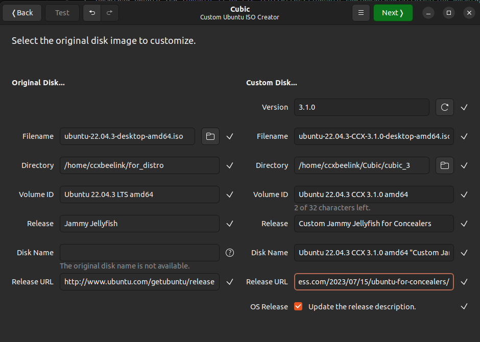
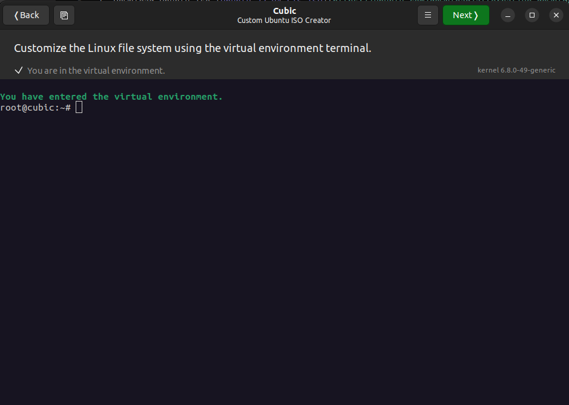
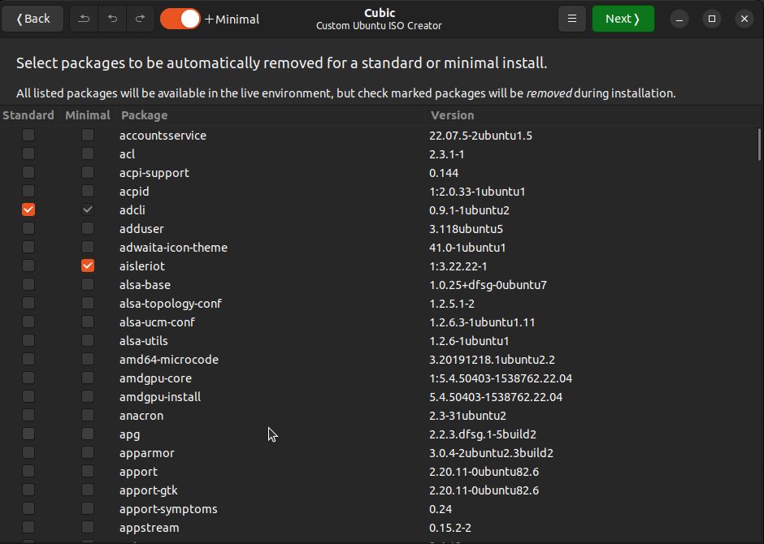
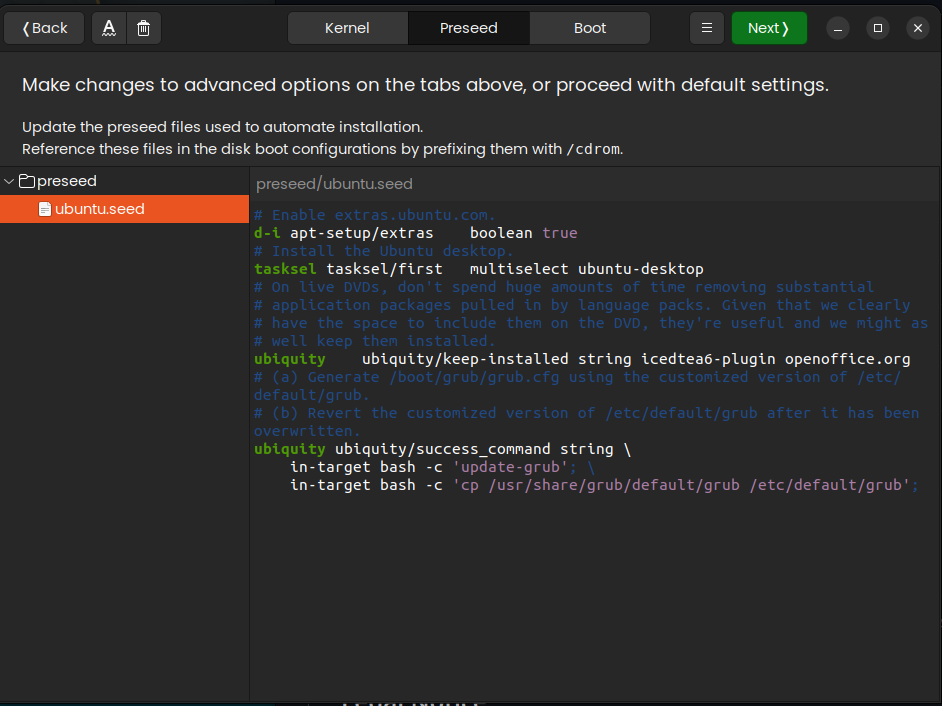

# RECIPE
here is a detailed step by step procedure to create your own Conceal OS iso file.

## Prerequisite
1. Download Ubuntu 22.04.1 LTS ISO (comes with kernel 5.15)
   - Direct download: [Ubuntu 22.04.1 LTS ISO](https://old-releases.ubuntu.com/releases/22.04.1/ubuntu-22.04.1-desktop-amd64.iso)
   - This specific version is required as it comes with kernel 5.15, which is optimal for mining operations
   - Do NOT use newer point releases (22.04.2+) as they come with kernel 6.x

## First step on Cubic
:warning: make sure the system you're using matches the same kernel as the downloaded iso (5.15), otherwise you may encounter some issues.


## Second step on Cubic

use the command line tool to customize.

## Cubic step by step CCX iso


- [ ] **update apt repository**
    ```
    add-apt-repository main universe restricted multiverse
    ```

- [ ] Update
    ```
    apt update
    ```

- [ ] **Clean up and set correct kernel**
    ```
    # Hold specific 5.15 kernel and its modules
    apt-mark hold linux-image-5.15.0-43-generic
    apt-mark hold linux-headers-5.15.0-43-generic
    apt-mark hold linux-modules-5.15.0-43-generic
    
    # Verify kernel version
    dpkg --list | grep linux-image

    #if needed:
    dpkg --purge linux-image-6.8.0-40-generic
    ```
    - [ ] **Essential Drivers and Firmware**
    ```   
    # Install firmware and drivers
    apt install -y \
        linux-firmware \
        amd64-microcode \
        xserver-xorg-video-amdgpu \
        network-manager
    
    # Ensure network-manager starts on boot
    systemctl enable NetworkManager
    
    # Install additional GPU support
    apt install -y \
        mesa-vulkan-drivers \
        libvulkan1 \
        vulkan-tools \
        vulkan-validationlayers
    
    # Update initramfs to include new firmware
    update-initramfs -u -k 5.15.0-43-generic

     # Prevent cryptsetup warnings
    echo "CRYPTSETUP=n" >> /etc/initramfs-tools/conf.d/cryptsetup
    ```
- [ ] **Remove unnecessary language packs** *(optional)*  
    ```
    apt remove -y language-pack-pt language-pack-pt-base 
    ```
    
- [ ] **tiny software**
    ```
    apt install mousepad git clinfo lm-sensors curl dbus-x11 jq zenity mesa-utils
    apt-get install openssh-server -y
    apt remove -y libreoffice-draw
    apt remove -y xubuntu-artwork xubuntu-community-wallpapers
    ```

- [ ] **Conceald**
    ```
    apt-get install -y build-essential python3-dev gcc g++ git cmake libboost-all-dev
    cd /opt
    git clone https://github.com/ConcealNetwork/conceal-core
    cd conceal-core
    mkdir build && cd build
    cmake ..
    make
    cd
    ```
    
- [ ] **nodejs & npm**
    ```
    curl -fsSL https://deb.nodesource.com/setup_20.x | sudo -E bash -
    apt install -y nodejs
    ```
    >In case of *error*, one solution is:    
        ```
        sudo dpkg -i --force-overwrite /var/cache/apt/archives/nodejs18
        ```
    ```
    apt install -y npm
    npm install -g npm@latest
    ```

- [ ] **Conceal guardian**
    ```
    cd /opt
    git clone https://github.com/ConcealNetwork/conceal-guardian.git
    cd conceal-guardian
    npm install
    ```
    you can copy in this folder (drag and drop) the file [config.json](./ingredients/opt/conceal-guardian/config.json), pre-set with fee to Conceal donation address.  
    you can personnalize it running:  
    ```
    node index.js --setup
    ```
    >*answer questions.*  

    To run has a service:  
    ```
    cd /etc/systemd/system    
    ```
    and copy the file [ccx-guardian.service](./ingredients/etc/systemd/system/ccx-guardian.service)  
    To enable the service:
    ```
    systemctl enable ccx-guardian.service
    cd
    ```

- [ ] **Conceal Desktop**
    ```
    apt install git gcc make cmake libboost-all-dev qtbase5-dev libqt5charts5-dev
    cd /opt
    git clone https://github.com/ConcealNetwork/conceal-desktop
    cd conceal-desktop
    rm -rf cryptonote
    git clone https://github.com/ConcealNetwork/conceal-core cryptonote
    make build-release
    mkdir bin && mv build/release/conceal-desktop bin/
    make clean
    ```
    icon and desktop shortcut:  
    ```
    cd /etc/skel
    mkdir .icons
    mkdir -p .local/share/applications

    ```
    copy [conceal.png](./ingredients/etc/skel/.icons/conceal.png) in **.icons**:
    ```
    cd .icons
    ```
    copy [conceal-desktop.desktop] in applications
    ```
    cd ..
    cd .local/share/applications/
    cd
    ```

- [ ] **Conceal-assistant**
    ```
    npm i -g nodemon
    npm i -g livereload
    cd /opt
    git clone https://github.com/Acktarius/conceal-assistant.git
    cd conceal-assistant
    npm install
    cd /etc/systemd/system
    ```
    copy [ccx-assistant.service](./ingredients/etc/systemd/system/ccx-assistant.service)
    ```
    systemctl enable ccx-assistant.service
    ```

- [ ] **amdgpu**
    ```
    cd /tmp
    wget https://repo.radeon.com/amdgpu-install/22.40.3/ubuntu/jammy/amdgpu-install_5.4.50403-1_all.deb
    apt-get install ./amdgpu-install_5.4.50403-1_all.deb
    rm amdgpu-install_5.4.50403-1_all.deb
    cd
    amdgpu-install -y --accept-eula --no-dkms --usecase=opencl --opencl=rocr
    ```

- [ ] **SRBMiner** (not open source ...otional)
    ```
    cd /opt
    wget https://github.com/doktor83/SRBMiner-Multi/releases/download/2.2.4/SRBMiner-Multi-2-2-4-Linux.tar.xz
    tar -xvf SRBMiner-Multi-2-2-4-Linux.tar.xz
    rm SRBMiner-Multi-2-2-4-Linux.tar.xz
    cd SRBMiner-Multi-2-2-4/
    ```
    copy [start-mining-conceal.sh](./ingredients/opt/SRBMIner-Multi-2-2-4/start-mining-conceal.sh)
    ```
    cd
    ```

- [ ] **xmr-stak** version for Concealers (with AMD GPU)
    ```
    apt install ocl-icd-opencl-dev libmicrohttpd-dev libssl-dev cmake build-essential \
    libhwloc-dev pkg-config libjsoncpp-dev libwxgtk3.0-gtk3-dev
    cd /opt
    wget https://ftp.gnu.org/gnu/libmicrohttpd/libmicrohttpd-0.9.16.tar.gz
    tar -xvf libmicrohttpd-0.9.16.tar.gz
    cd libmicrohttpd-0.9.16
    ./configure
    make
    make install
    cd ..
    wget https://download.open-mpi.org/release/hwloc/v2.8/hwloc-2.8.0.tar.gz
    tar -xvf hwloc-2.8.0.tar.gz
    cd hwloc-2.8.0
    ./configure
    make
    make install
    cd ..
    rm *.gz
    git clone https://github.com/Acktarius/xmr-stak.git
    cd xmr-stak/
    ```
    if you wish to change donation: `cd xmrstak` and change value in 
`donate-level.hpp`  
    ```
    mkdir build
    cd build
    cmake .. -DCUDA_ENABLE=OFF
    make install
    ```
    or
    ```
    ./ubuntu_AMD_builder.sh
    ```
*Notes:*
    * final user will have to run `./xmr-stak` for initial setup
    * run `sudo ./ubuntu_shortcut_creator.sh` to install day to day icon and shortcut
    * run mining service installation script to generate a service.

- [ ] Conceal Toolbox  
    ```
    cd /opt
    mkdir conceal-toolbox
    ```
    * **mem alloc fail solver**
        ```
        git clone https://github.com/Acktarius/mem-alloc-fail_solver.git
        cd mem-alloc-fail_solver
        chmod +x mem_alloc_fail-solver.sh
        ```
    * **mining service**  
        ```
        git clone https://github.com/Acktarius/ccx-mining_service.git
        mv ccx-mining_service mining_service/
        cd mining_service
        chmod 755 mining_s.sh
        ```
        - icon:  
        ```
        cd /etc/skel/.icons
        ```
        copy [ms.png](./ingredients/etc/skel/.icons/ms.png)   
         - shortcut:  
        ```
        cd /opt/conceal-toolbox/mining_service
        cp m-s_script.desktop /etc/skel/.local/share/applications/m-s_script.desktop
        ```
    * **ping ccx pool**  
    ```
    apt install build-essential cmake libwxgtk3.0-gtk3-dev git nlohmann-json3-dev nmap
    git clone https://github.com/Acktarius/ping_ccx_pool_cpp.git
    cd ping_ccx_pool_cpp.git
    mkdir build && cd build
    cmake -DINSTALL_POLKIT_POLICY=ON ..
    cmake --build .
    cmake --install .
    ```
    *make sure the policy file org.acktarius.nping.policy in /usr/share/polkit-1/actions/*  

    * **oc-amd**  
    ```
    cd /opt/conceal-toolbox
    git clone https://github.com/Acktarius/oc-amd.git
    cd oc-amd
    chmod 755 *.sh
    ```

    * **EZ Privacy**
    ```
    cd /opt/
    git clone https://github.com/Acktarius/EZ_Privacy.git
    cd EZ_Privacy
    chmod 755 ez_privacy.sh
    cp ez_privacy_logo3_128.png /etc/skel/.icons/
    cp ez_privacy.desktop /etc/skel/.local/share/applications/
    ```

    * **extension4Concealers**
    ```
    apt-get -y install gnome-shell-extension-prefs fonts-noto
    git clone https://github.com/p-e-w/argos.git
    cd argos
    git switch -c gnome-44 GNOME-44
    mkdir -p /etc/skel/.local/share/gnome-shell/extensions
    cp -r argos@pew-worldwidemann.com /etc/skel/.local/share/gnome-shell/extensions/
    cd ..
    rm -rf argos
    cd /opt/conceal-toolbox
    git clone https://github.com/Acktarius/extension4Concealers.git
    cd extension4Concealers
    chmod 755 gpu.2r.5m+.sh
    chmod 755 assistant.1r.1m+.sh
    mkdir -p /etc/skel/.config/argos
    cp gpu.2r.5m+.sh /etc/skel/.config/argos/gpu.2r.5m+.sh
    cp assistant.1r.1m+.sh /etc/skel/.config/argos/assistant.1r.1m+.sh
    ```

    * **CCX-BOX_Apps**  
    ```
    cd /opt/conceal-toolbox
    git clone https://github.com/Acktarius/CCX-BOX_Apps.git
    cd CCX-BOX_Apps
    chmod 755 updater.sh
    cd /etc/skel/.local/share/applications/
    ```
    copy [CCX-BOX_Apps_updater.desktop](./ingredients/etc/skel/.local/share/applications/CCX-BOX_Apps_updater.desktop)
    

- [ ] **zmotd**  
    ```
    cd /etc/profile.d
    ```
    copy [zmotd.sh](./ingredients/etc/profile.d/zmotd.sh)

	
- [ ] **Background**  
    ```
    cd /usr/share/backgrounds/
    # remove the existing symlink
    rm ubuntu-default-greyscale-wallpaper.png
    # Create a new symlink to your custom background
    ln -s ccxBackground5.jpg ubuntu-default-greyscale-wallpaper.png
    ```    
    copy all background files before like [ccxBackground.jpg](./ingredients/usr/share/backgrounds/ccxBackground.jpg)
    ```
    cd ../gnome-background-properties/
    ```
    copy [jammy-wallpaper.xml](./ingredients/usr/share/gnome-background-properties/jammy-wallpapers.xml)

    ```
    cd ../glib-2.0/schemas/
    ```
    copy [90_custom.gschema.override](./ingredients/usr/share/glib-2.0/schemas/90_custom.gschema.override)

    ```
    cd
    glib-compile-schemas /usr/share/glib-2.0/schemas
    ```

- [ ] **Terminal profile**
    ```
    cd /opt/conceal-toolbox
    ```
    copy the folder [custom_setup](./ingredients/opt/conceal-toolbox/)
    ```
    cd custom_setup
    chmod 755 setup_script.sh
    cp ss.png /etc/skel/.icons/
    cp setup_script.desktop /etc/skel/.local/share/applications/
    ```

- [ ] **.face**
    `cd /etc/skel/`
    copy [.face](./ingredients/etc/skel/.face)
    
- [ ] **bashrc and bash_aliases**
    ```
    cd /etc/skel
    rm .bashrc
    ```
    copy our [.bashrc](./ingredients/etc/skel/.bashrc) and [.bash_aliases](./ingredients/etc/skel/.bashrc_aliases)


- [ ] **Fonts**
    ```
    cd .local/share
    mkdir fonts
    ```
    as you wish copy the ttf file from [Poppins](./ingredients/etc/skel/.local/fonts/Poppins/)

- [ ] **Tweaks**
    ```
    apt install gnome-tweaks
    ```

- [ ] **Slideshow**  

    copy the file in their respective folder from [slides](./ingredients/usr/share/ubiquity-slideshow/slides/)  
    if you wish to have a slideshow for oem install:  
    ```    
    apt-get install oem-config-slideshow-ubuntu
    ```
    Then also copy the files under `/usr/share/oem-config-slideshow/slides/l10n/
    

 - [ ] **CCX Assistant firefox shortcut**
    ```
    cd /opt/conceal-toolbox
    ```
    copy [ccx-assistant_firefox.sh](./ingredients/opt/conceal-toolbox/ccx-assistant_firefox.sh)
    ```
    chmod 755 ccx-assistant_firefox.sh
    ```
    - icon
    ```
    cd /etc/skel/.icons/
    ```
    copy [cham.png]  
    - shortcut
    ```
    cd /etc/skel/.local/share/applications
    ```
    copy [ccx-assistant_firefox.desktop](./ingredients/etc/skel/.local/share/applications/ccx-assistant_firefox.desktop)
 

- [ ] Flatpak
    ```
    add-apt-repository ppa:flatpak/stable
    apt install flatpak -y
    flatpak remote-add --if-not-exists flathub https://flathub.org/repo/flathub.flatpakrepo
    ```
- [ ] **fail2ban**  
    ```
    apt install -y fail2ban
    cd /etc/fail2ban
    cp jail.conf jail.local
    ```
    Edit jail.local to set basic configuration:
    ```
    # In [DEFAULT] section:
    bantime = 1d
    findtime = 1d
    maxretry = 3

    # Enable SSH protection in [sshd] section:
    [sshd]
    enabled = true
    port = ssh
    filter = sshd
    logpath = %(sshd_log)s
    maxretry = 3
    findtime = 600
    bantime = 600
    ```
    Enable and start the service:
    ```
    systemctl enable fail2ban
    ```
- [ ] **Security**  
    ```
    # Install and configure UFW
    apt install -y ufw
    ufw default deny incoming
    ufw default allow outgoing
    ufw allow ssh
    ufw allow 16000/tcp  # Conceal port
    ufw allow 3500/tcp  # Conceal assistant port
    ufw --force enable
    ```

- [ ] **System Optimization**    
    ```
    # Add performance tweaks to sysctl
    echo "vm.swappiness=10" >> /etc/sysctl.conf
    echo "vm.vfs_cache_pressure=50" >> /etc/sysctl.conf
    
    # For mining optimization
    echo "kernel.sched_migration_cost_ns=5000000" >> /etc/sysctl.conf
    echo "kernel.sched_autogroup_enabled=0" >> /etc/sysctl.conf    
    ```

4. **Monitoring Tools**
    ```
    Consider adding monitoring tools:
    apt install -y htop iotop nmon
    ```

- [ ] **GRUB**
    ```
    nano /etc/default/grub
    ```
    *append GRUB_CMDLINE_LINUX_DEFAULT with :* `amdgpu.ppfeaturemask=0xffffffff`  
    
    ```
    cp /etc/default/grub /usr/share/grub/default/grub
    ```
- [ ] **GRUB Display Configuration**
    ```
    # Backup original grub config
    cp /etc/default/grub /etc/default/grub.backup
    
    # Update GRUB configuration
    # append GRUB_CMDLINE_LINUX_DEFAULT
    #with:  video=HDMI-A-1:1920x1080
    
    # Add kernel parameters for better GPU support
    echo 'GRUB_GFXMODE="1920x1080"' >> /etc/default/grub
    echo 'GRUB_GFXPAYLOAD_LINUX="keep"' >> /etc/default/grub
    
    # Update GRUB
    update-grub
    ```


## Third step on Cubic

Select package you want to remove (i.e. save some space removing some languages)

## Fourth step on Cubic


Modify presseed to take grub modification into account:  
> (a) Generate /boot/grub/grub.cfg using the customized version of /etc/default/>grub.  
>(b) Revert the customized version of /etc/default/grub after it has been >overwritten.  

```
ubiquity ubiquity/success_command string \
    in-target bash -c 'update-grub'; \
    in-target bash -c 'cp /usr/share/grub/default/grub /etc/default/grub';
```

---

### Extra

- [ ] **Plymouth Splash Screen**
    ```
    # Install Plymouth tools
    apt install plymouth-themes plymouth-theme-spinner
    
    # Create a custom theme directory
    mkdir -p /usr/share/plymouth/themes/conceal-logo
    
    # Copy theme files
    cp splash.png /usr/share/plymouth/themes/conceal-logo/
    cp progress_box.png /usr/share/plymouth/themes/conceal-logo/
    cp progress_bar.png /usr/share/plymouth/themes/conceal-logo/
    cp conceal-logo.plymouth /usr/share/plymouth/themes/conceal-logo/
    cp conceal-logo.script /usr/share/plymouth/themes/conceal-logo/
    
    # Set permissions
    chmod 644 /usr/share/plymouth/themes/conceal-logo/*
    
      
    # Set the custom theme
    update-alternatives --install /usr/share/plymouth/themes/default.plymouth default.plymouth /usr/share/plymouth/themes/conceal-logo/conceal-logo.plymouth 100
    update-alternatives --set default.plymouth /usr/share/plymouth/themes/conceal-logo/conceal-logo.plymouth
    
    # Ensure Plymouth is in initramfs
    echo "FRAMEBUFFER=y" > /etc/initramfs-tools/conf.d/plymouth
    
    # Configure Plymouth to show during boot and shutdown
    #append GRUB_CMDLINE_LINUX_DEFAULT
    # with: plymouth.enable=1
    
    # Update initramfs
    update-initramfs -u -k 5.15.0-91-generic

    # List available themes
    update-alternatives --list default.plymouth
    ```

- [ ] **Plymouth Progress Bar Creation**
    ```
    # Install ImageMagick
    apt install -y imagemagick
    
    # Create progress box (container)
    convert -size 200x20 xc:transparent \
        -fill none \
        -stroke '#323436' \
        -strokewidth 2 \
        -draw "roundrectangle 0,0 199,19 10,10" \
        /usr/share/plymouth/themes/conceal-logo/progress_box.png
    
    # Create progress bar (fill) - orange gradient
    convert -size 196x16 \
        gradient:'#cc8400-#ffa500' \
        -draw "roundrectangle 0,0 195,15 8,8" \
        /usr/share/plymouth/themes/conceal-logo/progress_bar.png
    ```

- [ ] **Background and Theme Settings**
    ```
    # Copy schema override file
    cp 90_custom.gschema.override /usr/share/glib-2.0/schemas/
    
    # Compile schemas
    glib-compile-schemas /usr/share/glib-2.0/schemas/
    ```
